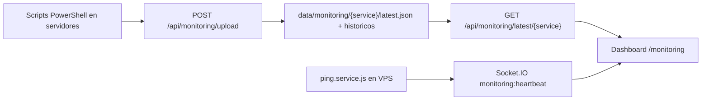

# Monitoreo IT - Arquitectura y flujo de datos

## Resumen

El modulo combina dos fuentes de informacion:

- **Reportes periodicos** generados por scripts PowerShell en servidores Windows.
- **Heartbeat en tiempo real** ejecutado desde el VPS para ping ICMP y prueba TCP.

Esta separacion es clave: los datos pesados pueden recolectarse una o dos veces al dia, pero el estado de conectividad y latencia se mantiene fresco desde el backend.

## Flujo general



## Backend

### Recepcion de reportes

Endpoint:

```http
POST /api/monitoring/upload
```

Payload esperado:

```json
{
  "service": "SERV-ZK",
  "data": {},
  "html": "<html>...</html>"
}
```

El backend guarda:

- `data/monitoring/{service}/latest.json`
- `data/monitoring/{service}/latest.html`
- `data/monitoring/{service}/report_{timestamp}.json`
- `data/monitoring/{service}/report_{timestamp}.html`

Si el script no envia HTML, el backend genera un reporte basico desde el JSON.

### Lectura de estado actual

```http
GET /api/monitoring/latest/:service
```

Servicios consumidos actualmente por el Dashboard:

- `ANFIGANE`
- `ANFI-SEG`
- `AD`
- `AD-DC02`
- `AD-DC03`
- `KSC`
- `SERV-ZK`
- `KSC-HARDWARE`

### Historial

```http
GET /api/monitoring/history/:service
DELETE /api/monitoring/history/:service/:filename
GET /api/monitoring/html/:service/:filename
```

La vista `Detalles Monitoreo` usa estos endpoints para listar, abrir o eliminar reportes historicos.

## Heartbeat

Archivo:

```text
src/services/ping.service.js
```

Frecuencia:

- Check inicial a los 2 segundos.
- Repeticion cada 10 segundos.

Emite por Socket.IO:

```text
monitoring:heartbeat
```

Nodos ICMP monitoreados:

| ID | Objetivo |
| --- | --- |
| `ANFIGANE` | Host 1 |
| `AD` | AD01 |
| `AD-DC02` | AD02 |
| `AD-DC03` | AD03 |
| `ANFI-SEG` | Host 2 |
| `KSC` | SERV-KSC |
| `PROXMOX-ZK` | Host Proxmox ZK |
| `SERV-ZK` | VM ZKBio |

Pruebas TCP:

| ID | Puerto | Uso |
| --- | --- | --- |
| `BABYWARE` | `16001` | Disponibilidad del servicio BabyWare |

El backend tambien emite alias para facilitar compatibilidad con la UI, por ejemplo:

- `SERV-KSC` y `192.168.8.42` apuntan a `KSC`.
- `PROXMOX` y `192.168.8.50` apuntan a `PROXMOX-ZK`.
- `ZK` y `192.168.8.112` apuntan a `SERV-ZK`.
- `BABYWARE-16001`, `SERV-ZK:16001` y `192.168.8.112:16001` apuntan a `BABYWARE`.

## Frontend

### Dashboard principal

Archivo:

```text
CRM_Frontend/src/pages/Monitoring.jsx
```

Responsabilidades:

- Consultar `latest` cada minuto.
- Escuchar `monitoring:heartbeat`.
- Renderizar jerarquia host -> VM.
- Calcular estados visuales de ping fresco, stale u offline.
- Mostrar KPIs, discos, servicios, backups y actualizaciones.
- Renderizar inventario KSC y graficos animados.
- Gestionar layout editable.
- Mostrar notificaciones inteligentes.

### Frescura del ping en UI

El frontend maneja tres ventanas:

| Ventana | Comportamiento |
| --- | --- |
| Menos de 45 segundos | Ping fresco, LED y latencia confiables |
| 45 a 120 segundos | Estado stale, se muestra como precaucion |
| Mas de 120 segundos | Se considera dato viejo para recomendaciones |

### Dashboard editable

Clave `localStorage`:

```text
skylab.monitoring.dashboardLayout.v1
```

Paneles configurables:

- `anfigane`
- `anfi-seg`
- `ksc-summary`
- `zk-summary`
- `ksc-inventory`

## Notificaciones inteligentes

El motor de recomendaciones vive en `Monitoring.jsx`.

Frecuencia:

- Primer aviso: despues de cargar datos.
- Repeticion: cada 5 minutos.
- Duracion visible: 30 segundos.

Reglas actuales:

- Nodo con ping `DOWN`.
- Heartbeat stale.
- Servicios KSC o ZK por debajo del total esperado.
- BioPlatform con servicios no saludables.
- BabyWare sin confirmacion de disponibilidad.
- Disco C: bajo 25% o critico bajo 15%.
- Amenazas Kaspersky activas o detectadas.
- Licenciamiento KSC por encima de 90%.
- Inventario KSC con frescura semanal baja.

El sonido se genera en el navegador con Web Audio API. Puede requerir una interaccion previa del usuario por politicas de autoplay del navegador.

